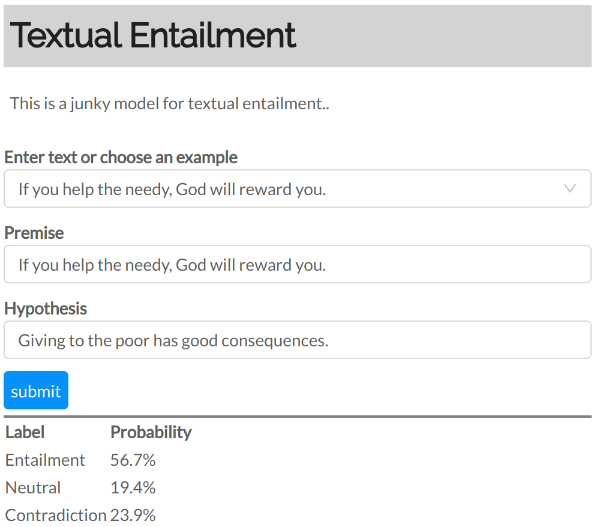

# AllenNLP Simple Demo

AllenNLP has a [really nice demo](https://demo.allennlp.org), but to add models to it you have to write a lot of ReactJS.
AllenNLP also comes with a ["simple server"](https://allenai.github.io/allennlp-docs/api/allennlp.service.server_simple.html) that requires writing no code at all, but it's limited text-in-JSON-out.

This is an attempt to bridge the gap. It contains an `index.html` that has all of the imports and plumbing,
and requires you to write a minimal `demo.js` with just the specifics of your demo.

## Running the Simple Demo

If you have both files in the same directory
(and if you have `allennlp` pip installed) you can run the demo with

```bash
$ python -m allennlp.service.server_simple \
            --static-dir textual-entailment/ \
            --archive-path textual-entailment/model.tar.gz \
            --predictor textual-entailment
```

And you'll get a demo that looks like



running on localhost:8000.

## Writing `demo.js`

Of the three demos here, the textual-entailment is the simplest and indicative of how you'd write your `demo.js`. First, you have to update the title and description:

```js
// TODO: 1. Update the title
const title = "Textual Entailment"

// TODO: 2. Update the description
const description = "This is a junky model for textual entailment.."
```

Next, you need to update the input fields. The textual entailment demo needs only two text fields,
but there are other types of fields defined in `index.html`, you can look at the reading comprehension demo to see them.

```js
// TODO: 3. Update the inputs. The "name" will be the key in the JSON
//          that gets sent to your model, so make sure it's what the
//          backend is expecting.
const inputFields = [
    {name: "premise", label: "Premise", type: "text"},
    {name: "hypothesis", label: "Hypothesis", type: "text"},
]
```

The next step is to update the dropdown examples:

```js
// TODO: 4. Update the drop-down examples + exampleField + exampleMaxLength.
//          If you don't want a drop-down, just make this list be empty.
const examples = [
   {premise: "An elephant is walking near a river.",
    hypothesis: "The elephant is gray."},
    {premise: "If you help the needy, God will reward you.",
    hypothesis: "Giving to the poor has good consequences."},
]

const exampleField = "premise"  // Which field to show in the dropdown?

const exampleMaxLength = 50     // How many characters of it to show?
```

So far this should be pretty straightforward. The last step is less straightforward, and that's
to write the React component that actually generates your output. Even if you don't know React,
you can probably manage to modify what we did here.

The trickiest part is that `result` is whatever's returned by your Model / Predictor,
so it's your responsibility to know what data it contains.

Here the result contains many things, but we'll just render a table containing the label probabilities:

```js
// TODO: 5. Update the output
const LABELS = ["Entailment", "Neutral", "Contradiction"]

const Output = ({ result }) => {
    // 5a. Destructure JSON result and (optionally) rename to camelCase.
    //     You'll need to change this to reflect the fields / structure of
    //     your model's response.

    const { label_probs: labelProbs } = result

    const predictionRows = labelProbs.map((probability, idx) => (
        <tr>
            <td>{LABELS[idx]}</td>
            <td>{`${(probability * 100).toFixed(1)}%`}</td>
        </tr>
   ))

    // 5b. And generate output based on the result.
    return (
        <table>
            <tr>
                <th>Label</th>
                <th>Probability</th>
            </tr>
            {predictionRows}
        </table>
    )
}
```

## Other Demos

To get a sense of what else is possible, the `reading-comprehension` demo constructs a highlighted paragraph, and the coreference resolution demo renders a complex nested tree of coreference classes. (The tiny included toy models for all of these are terrible, though.)

### Textual Entailment

```bash
$ python -m allennlp.service.server_simple \
            --static-dir textual-entailment/ \
            --archive-path textual-entailment/model.tar.gz \
            --predictor textual-entailment
```

### Reading Comprehension

```bash
$ python -m allennlp.service.server_simple \
            --static-dir reading-comprehension/ \
            --archive-path reading-comprehension/model.tar.gz \
            --predictor machine-comprehension
```

### Text Classification

```bash
python -m allennlp.service.server_simple \
          --static-dir text-classification \
          --archive-path text-classification/model.tar.gz \
          --predictor text_classifier
```

### Coreference Resolution

```bash
python -m allennlp.service.server_simple \
          --static-dir coref \
          --archive-path coref/model.tar.gz \
          --predictor coref
```

### Sequence Tagging
